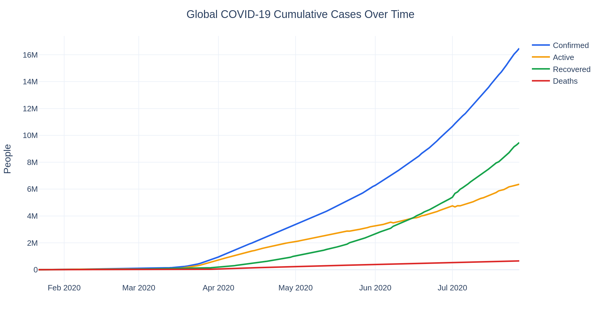
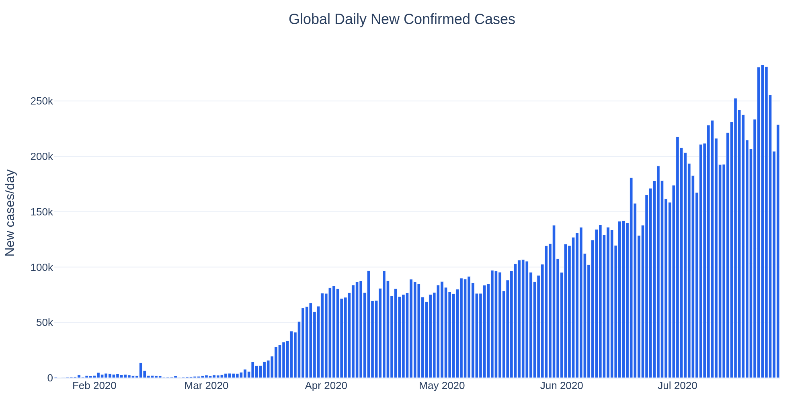
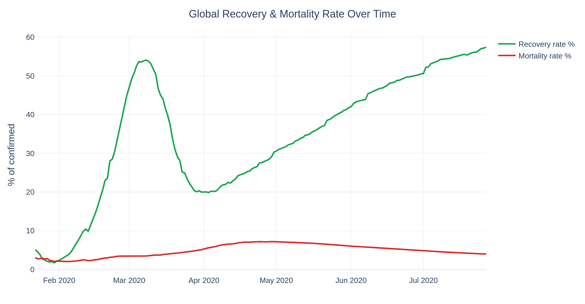
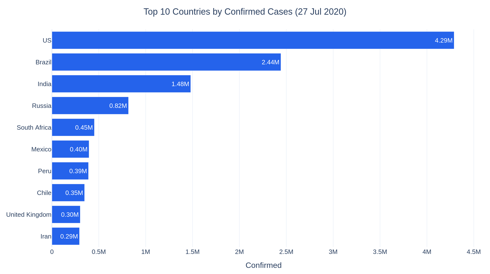
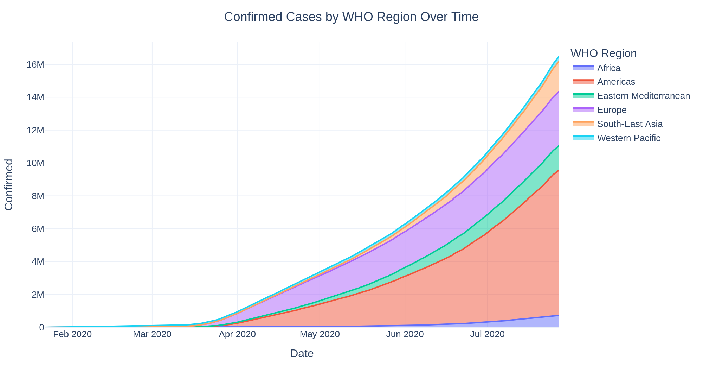
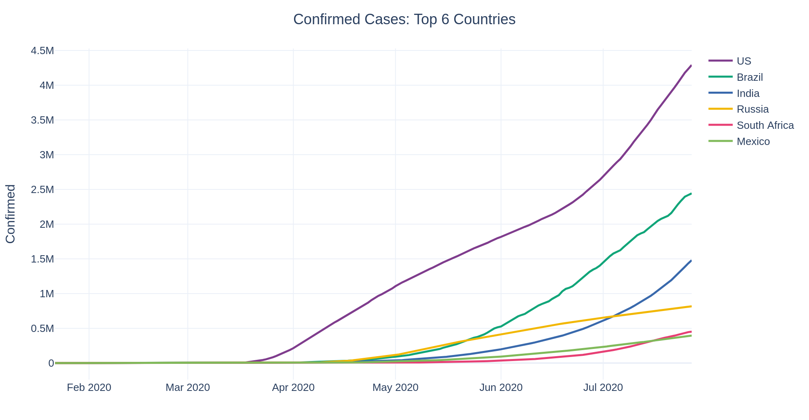
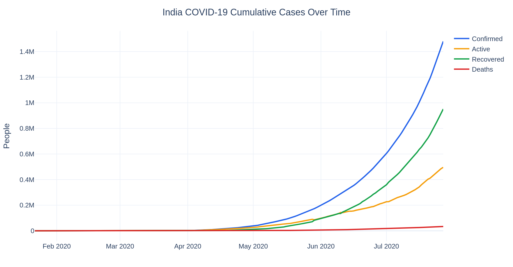
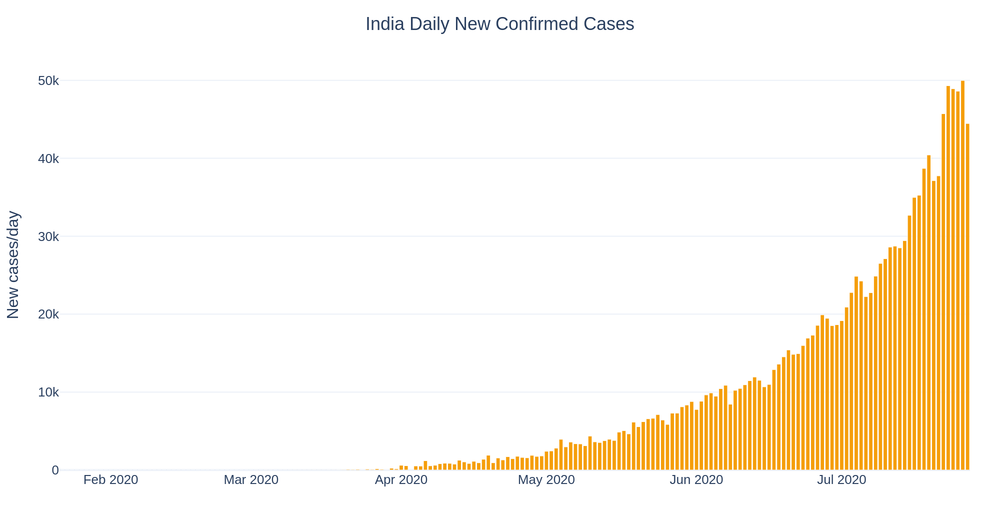
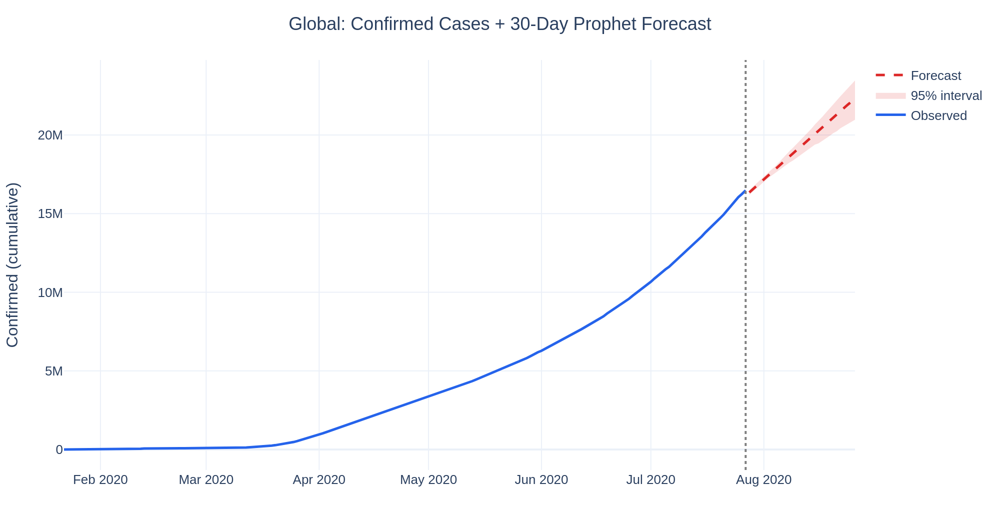
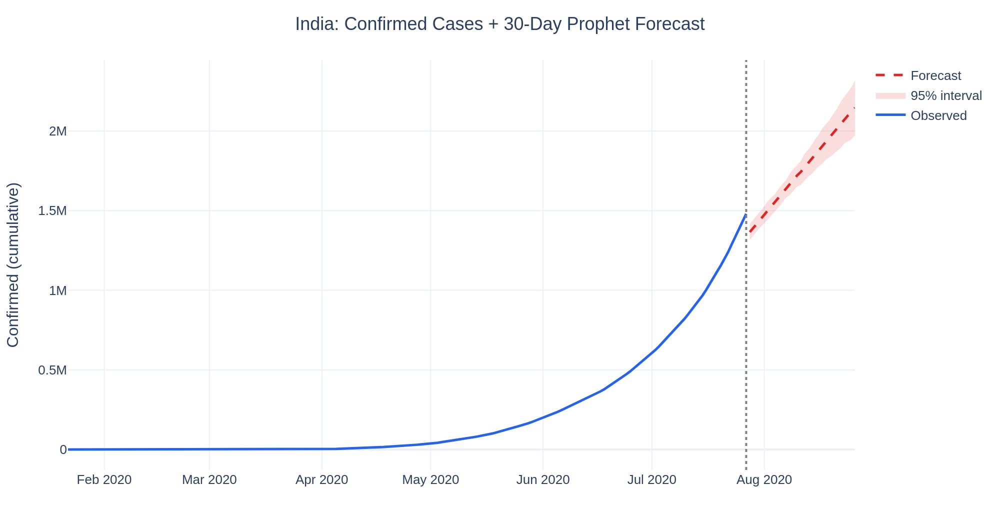

<div align="center">


# 🦠 Analyzing the Trends of COVID-19 with Python

#### Impact Analysis · Interactive Plotly Visualizations · Prophet Time-Series Forecasting

*Python for Data Science Capstone — Intellipaat*

<br/>


<br/>

[](https://colab.research.google.com/github/AnkitSaxena-AI/covid19-analysis-forecasting/blob/main/COVID19_Analysis_Forecasting.ipynb)
[](https://nbviewer.org/github/AnkitSaxena-AI/covid19-analysis-forecasting/blob/main/COVID19_Analysis_Forecasting.ipynb)
[-EC1C24?style=for-the-badge&logo=adobeacrobatreader&logoColor=white)](reports/COVID19_Capstone_Report.pdf)
[-217346?style=for-the-badge&logo=microsoftexcel&logoColor=white)](covid_global_forecast.csv)

</div>

> 💡 **The charts in this project are interactive.** GitHub shows static snapshots below — click **[nbviewer](https://nbviewer.org/github/AnkitSaxena-AI/covid19-analysis-forecasting/blob/main/COVID19_Analysis_Forecasting.ipynb)** or **[Open in Colab](https://colab.research.google.com/github/AnkitSaxena-AI/covid19-analysis-forecasting/blob/main/COVID19_Analysis_Forecasting.ipynb)** to zoom, hover and explore the live Plotly figures.

---

## 📑 Table of Contents

<a id="toc"></a>

- [🎯 Overview](#overview)
- [🧩 Problem Statement](#problem-statement)
- [🗃️ Dataset](#dataset)
- [🛠️ Tech Stack](#tech-stack)
- [🗂️ Project Structure](#project-structure)
- [📊 Global Trends](#global-trends)
- [🌍 Geographic Distribution](#geography)
- [🇮🇳 India Deep-Dive](#india)
- [🔮 Forecasting with Prophet](#forecasting)
- [🚀 Getting Started](#getting-started)
- [📁 Output Files](#outputs)
- [👤 Author](#author)
- [📄 License](#license)

---

<a id="overview"></a>

## 🎯 Overview

This project analyses the daily global progression of COVID-19 (Jan–Jul 2020), visualizes the **rate of infection and recovery**, and uses **Facebook Prophet** to **forecast confirmed cases about a week into the future**, exactly as set out in the Intellipaat brief.

### ⭐ Key Results at a Glance

| Aspect | Finding (as of 27 Jul 2020) |
|---|---|
| 🌐 **Global cases** | **16.5M** confirmed · 654K deaths · 9.47M recovered |
| 📈 **Trend** | Still **accelerating** — peak ~**282,800** new cases/day (23 Jul) |
| 💚 **Recovery rate** | Rose to **~57%**; mortality settled at **~4%** |
| 🏆 **Worst affected** | **US** (4.29M), **Brazil** (2.44M), **India** (1.48M) |
| 🇮🇳 **India** | 1.48M cases · recovery **~64%** · mortality **~2.3%** |
| 🔮 **Forecast accuracy** | Global **3.8%** · Brazil **1.9%** · US **5.7%** · India **14.3%** (7-day MAPE) |

---

<a id="problem-statement"></a>

## 🧩 Problem Statement

> *Given data about COVID-19 cases, visualize the impact and analyze the trend of the rate of infection and recovery, and make predictions about the number of cases expected a week in the future based on current trends.*

**Guidelines:** use **pandas** to wrangle the data, **Plotly** for interactive visualizations, and **Facebook Prophet** for time-series modelling.

---

<a id="dataset"></a>

## 🗃️ Dataset

`covid_19_clean_complete.csv` — **49,068 rows**, **187 countries**, daily from **22 Jan → 27 Jul 2020** (188 days).

| Column | Description |
|---|---|
| `Province/State` | Sub-national region (often blank) |
| `Country/Region` | Country / region name |
| `Lat`, `Long` | Geographic coordinates |
| `Date` | Observation date (daily) |
| `Confirmed` / `Deaths` / `Recovered` / `Active` | Cumulative case counts |
| `WHO Region` | World Health Organization region |

---

<a id="tech-stack"></a>

## 🛠️ Tech Stack

| Purpose | Library |
|---|---|
| Data wrangling | **pandas**, **NumPy** |
| Interactive visualization | **Plotly** |
| Time-series forecasting | **Facebook Prophet** |
| Environment | **Jupyter Notebook** |

---

<a id="project-structure"></a>

## 🗂️ Project Structure

```text
covid19-analysis-forecasting/
├── COVID19_Analysis_Forecasting.ipynb   # 📓 Full analysis + forecasting notebook (interactive)
├── covid_19_clean_complete.csv          # 🗃️ Source data (187 countries × 188 days)
├── covid_global_forecast.csv            # 🔮 30-day Prophet forecast (global) + 95% bands
├── covid_india_forecast.csv             # 🔮 India forecast
├── covid_us_forecast.csv                # 🔮 US forecast
├── covid_brazil_forecast.csv            # 🔮 Brazil forecast
├── requirements.txt                     # 📦 Dependencies
├── LICENSE                              # 📄 MIT
├── reports/
│   ├── COVID19_Capstone_Report.docx     # 📝 Full written report
│   └── COVID19_Capstone_Report.pdf
└── assets/                              # 🖼️ Chart snapshots used in this README
```

---

<a id="global-trends"></a>

## 📊 Global Trends

Confirmed cases grew **exponentially** to 16.5M, with daily new cases still climbing at the end of the data.

<p align="center"></p>
<p align="center"></p>

The **recovery rate** rose steadily to ~57%, while the **mortality rate** settled near ~4% after an early, testing-driven spike — clear evidence of improving outcomes.

<p align="center"></p>

---

<a id="geography"></a>

## 🌍 Geographic Distribution

<table>
<tr>
<td width="50%"></td>
<td width="50%"></td>
</tr>
</table>

<p align="center"></p>

The **Americas** dominated the case load, followed by **Europe** and **South-East Asia**. Case-fatality rates varied widely — the **UK (~15%)** and **Mexico (~11%)** far exceeded **India (~2.3%)** — reflecting differences in testing coverage and demographics more than the virus itself.

> 🗺️ The notebook also includes an **interactive world choropleth map** — view it on [nbviewer](https://nbviewer.org/github/AnkitSaxena-AI/covid19-analysis-forecasting/blob/main/COVID19_Analysis_Forecasting.ipynb).

---

<a id="india"></a>

## 🇮🇳 India Deep-Dive

India recorded its first case on **30 Jan 2020**, stayed flat through spring, then entered **steep exponential growth** from June — reaching **1.48M cases** with a strong **~64% recovery rate** and a low **~2.3% mortality rate**.

<p align="center"></p>
<p align="center"></p>

---

<a id="forecasting"></a>

## 🔮 Forecasting with Prophet

Cumulative confirmed cases were modelled with **Facebook Prophet** (piecewise-linear trend + weekly seasonality), forecasting **30 days ahead**. Accuracy was validated on a **7-day holdout** (MAPE).

| Region | Last actual (27 Jul) | Forecast +7 days | 7-day MAPE |
|---|:---:|:---:|:---:|
| 🌐 Global | 16,480,485 | **17,598,852** | **3.76%** |
| 🇧🇷 Brazil | 2,442,375 | 2,680,543 | **1.93%** |
| 🇺🇸 US | 4,290,259 | 4,582,593 | 5.65% |
| 🇮🇳 India | 1,480,073 | 1,531,948 | 14.29% |

<p align="center"></p>
<p align="center"></p>

The global model is accurate at the one-week horizon (**~3.8% MAPE**). India is hardest to forecast (~14%) because it was in its **steepest acceleration phase** — linear extrapolation lags a curve that is still bending upward. Full forecasts (with 95% bands) are in the `covid_*_forecast.csv` files.

---

<a id="getting-started"></a>

## 🚀 Getting Started

```bash
# 1. Clone
git clone https://github.com/AnkitSaxena-AI/covid19-analysis-forecasting.git
cd covid19-analysis-forecasting

# 2. (Optional) virtual environment
python -m venv .venv
source .venv/bin/activate        # Windows: .venv\Scripts\activate

# 3. Install dependencies
pip install -r requirements.txt

# 4. Launch the notebook
jupyter notebook COVID19_Analysis_Forecasting.ipynb
```

No setup? Run it in the cloud:

[](https://colab.research.google.com/github/AnkitSaxena-AI/covid19-analysis-forecasting/blob/main/COVID19_Analysis_Forecasting.ipynb)

---

<a id="outputs"></a>

## 📁 Output Files

| File | What's inside |
|---|---|
| [`COVID19_Analysis_Forecasting.ipynb`](COVID19_Analysis_Forecasting.ipynb) | End-to-end: cleaning → EDA → interactive charts → Prophet forecasts |
| [`covid_global_forecast.csv`](covid_global_forecast.csv) | 30-day global forecast with `Lower_95` / `Upper_95` |
| `covid_india_forecast.csv`, `covid_us_forecast.csv`, `covid_brazil_forecast.csv` | Country forecasts |
| [`reports/COVID19_Capstone_Report.pdf`](reports/COVID19_Capstone_Report.pdf) | Full written report with figures & tables |

---

<a id="author"></a>

## 👤 Author

**Ankit Saxena**

[](https://github.com/AnkitSaxena-AI)
[](mailto:gungunsaxena.0001@gmail.com)

> 💡 If you found this project useful, please consider giving it a ⭐!

---

<a id="license"></a>

## 📄 License

Released under the **MIT License** — see [`LICENSE`](LICENSE).

<div align="center">

---

*Built with pandas, Plotly & Prophet · © 2026 Ankit Saxena · Data: JHU CSSE / Kaggle COVID-19 dataset*

[⬆ Back to top](#toc)

</div>
